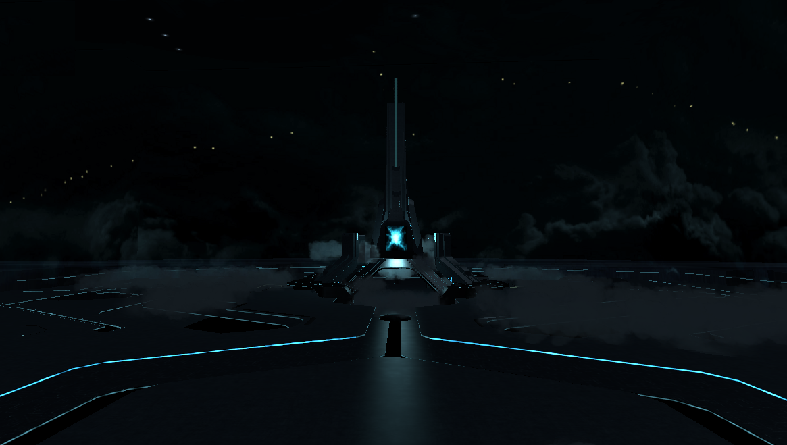

# Tron-R{reboot||reloaded}
main repository of the Tron-R{reboot||reloaded} game project

#### THE PROJECT

This is the main part of the Tron-R{reboot||reloaded} project which attempt to be a new open-source game 
based on Tron. This game is based on Tron Legacy and Stand for replace the proprietary Tron evolution game 
made after the film.

- several skins
 
- open-world 
 
- items
 
- better
 

suggestions: jimy.byerley@gmail.com

#### PLAY

to write

#### COMPATIBILITY

OS platform: Linux (tested), but mabe windows and maxOS should work too.
Blender :  version >= 2.70  (made with blender 2.73)

bugs: jimy.byerley@gmail.com
