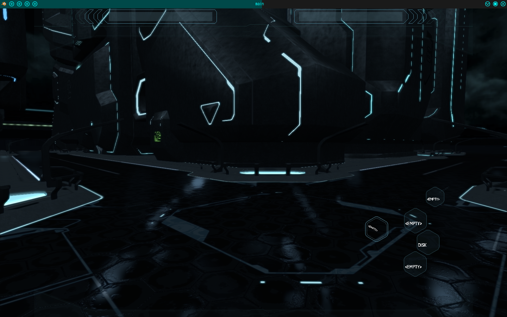

# Tron-R{reboot||reloaded}
main repository of the Tron-R{reboot||reloaded} game project

#### THE PROJECT

This is the main part of the Tron-R{reboot||reloaded} project which attempt to be a new open-source game 
based on Tron. This game is based on Tron Legacy and Stand for replace the proprietary Tron evolution game 
made after the film.

- several skins
 
- open-world 
 
- items
 
- better
 

suggestions: jimy.byerley@gmail.com

#### PLAY

Extract the zip file in the installation path

Build/optimize the game
-----------------------

	It will download the blender software from the official repository and remove useless files.
	GNU/Linux: 
		You will need wget to be installed
		# apt-get install wget
		$ ./build.sh
	or
		$ ./build.sh -d       (developer mode: don't remove useless files)
	or
		$ ./build.sh -p PATH  specify to use PATH for blender instead of downloading it. This path is the location where the blenderplayer executable is.

	Windows:
		run build.bat (download blender and remove useless files)
	If you know what you do, you can also change the blenderplayer executable path, by changing value in blenderplayer_path.txt

Launch it!
----------
	GNU/Linux:
	$ ./aperture.sh         (flynn like mode)
	$ ./tron-r              (standard game menu mode)
	$ ./mainscene_loader.sh (manual mode : puts you directly in the virtual world)

	Windows:
	Execute Tron-R executable file

#### COMPATIBILITY

OS platform: Linux (tested), but mabe windows and maxOS should work too.
Blender :  version >= 2.70  (made with blender 2.72)

bugs: jimy.byerley@gmail.com
